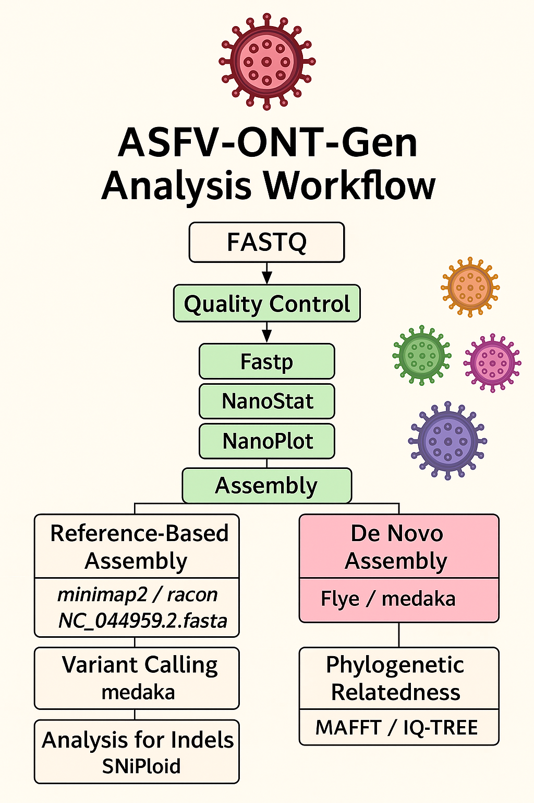

# ASFV-ONT-Gen: A Pipeline for African Swine Fever Virus ONT Whole-Genome Analysis

**ASFV-ONT-Gen** is a modular pipeline for analyzing whole-genome sequencing data of African Swine Fever Virus (ASFV) using Oxford Nanopore Technologies (ONT). It covers preprocessing, assembly, annotation, and phylogenetic analysis using a reference genome such as `NC_044959.2.fasta`.

---

## Features
- **Swine sequence removal**: Hostile, accurate host read removal 
- **Quality control**: FastQC, NanoPlot, MultiQC
- **Read mapping**: Minimap2
- **Taxonomic classification**: Kraken2 with viral database
- **Assembly**: De novo (Flye + Medaka polish) & reference-based
- **Variant calling & annotation**: BCFtools and SnpEff
- **Multi-threading**: Efficient parallel processing
- **Summary reports**: MultiQC, assembly stats, mapping summaries
- **Phylogenetics**: MAFFT, IQ-TREE, and ggtree

---
### Pipeline workflow




## Installation

### Prerequisites

- [Conda](https://docs.conda.io/projects/conda/en/latest/user-guide/install/)

- Java 21+ (for SnpEff)

### Hostile clean Swine pipeline 

## Dependencies

Ensure these tools are installed in your environment:


# Tool	installation command

```bash

# Install all dependencies in one command:

conda create -n hostile_env -c bioconda ncbi-datasets-cli minimap2 hostile

conda activate hostile_env

Required arguments:

Argument	description

--fasta	NCBI accession (e.g., GCF_000003025.6) or path to existing FASTA file
-i/--input	Text file listing paths to FASTQ files (one per line)
-o/--output	Directory to store all results

Optional arguments:

Argument	default	description

--index-dir	minimap2_index	Directory for Minimap2 indexes
--reference-dir	references	Directory for downloaded NCBI references


```

### Basic usage


```bash

python3 hostile_clean_swine.py \
  --fasta <ACCESSION_OR_PATH> \
  -i <INPUT_LIST> \
  -o <OUTPUT_DIR>

```

python3 hostile_clean_swine.py --fasta GCF_000003025.6 -i ASFV_fastq_samples_list.txt -o Clean


## Common use-cases

First-time run (auto-download):

 - Script downloads reference, builds index, and processes samples.

Reusing existing references:


 - If reference already exists in --reference-dir, skips download.

 - If index exists in --index-dir, skips rebuilding.

## Output structure

```bash

<OUTPUT_DIR>/

├── sample1_cleaned/
│   └── sample1.clean.fastq.gz
├── sample2_cleaned/
│   └── sample2.clean.fastq.gz
└── hostile.log

```

### Environment setup for genomic analysis

```bash
conda env create -f AFSV_ont.yml
conda activate AFSV_ont
conda install -c bioconda -c conda-forge fastqc nanoplot minimap2 samtools bcftools medaka \
multiqc spades kraken2 mafft fasttree seqtk flye krona snpeff -y

```

### Setup Kraken2 database

```bash
bash scripts/setup_kraken_db.sh

```

---

## Usage

### Run whole-genome analysis

```bash
python AFSV_ont_pipeline.py -inputs fastq_sample.txt -reference reference.fasta -threads 8
```
### Example sample_list.txt

```bash
/home/user/ASFV_data/Sample_01_ONT_reads.fastq.gz
/home/user/ASFV_data/Sample_02_ONT_reads.fastq.gz
/home/user/ASFV_data/Sample_03_ONT_reads.fastq.gz
---

### Environment setup for phylogenetic analysis

```bash
conda env create -f asfv_phylogeny.yml
conda activate asfv_phylogeny
```

### Run phylogenetic inference

```bash
asfv_phylogeny.py -r NC_044959.2.gb -i fasta_sample.txt -o results -t 8 -b 1000

```

### Example fasta_sample.txt
```bash
/home/user/ASFV_assemblies/Sample_01_assembly.fasta
/home/user/ASFV_assemblies/Sample_02_assembly.fasta
/home/user/ASFV_assemblies/Sample_03_assembly.fasta
---

## Inputs and outputs

### Inputs for genomic analysis

| File Type        | Description                |
|------------------|----------------------------|
| `*.fastq`        | ONT sequence files         |
| `reference.fasta`| ASFV reference genome      |

### Inputs for Phylogenetic Analysis

| Parameter         | Description                          | Default       |
|-------------------|--------------------------------------|---------------|
| `-inputs`         | File with FASTQ paths                | Required      |
| `-reference`      | ASFV reference genome                | Required      |
| `-threads`        | CPU threads for parallel steps       | `8`           |
| `-bootstrap`      | Phylogenetic bootstrap replicates    | `1000`        |
| `-min_coverage`   | Consensus calling threshold          | `20x`         |
| `-tree_model`     | IQ-TREE substitution model           | `MFP (auto)`  |
| `-aln_consensus`  | trimAl conservation threshold        | `60%`         |

---

### Output structure

```text
results/
├── 00_RawDataQC/          # FastQC/NanoPlot reports
├── 01_Assemblies/         # Flye & Medaka outputs
├── 02_Variants/           # VCF files & annotations
├── 03_Phylogeny/
│   ├── alignment.fasta    # MAFFT multiple alignment
│   ├── trimmed_alignment/ # trimAl filtered sequences
│   ├── iqtree_results/    # Tree files + support values
│   └── phylogeny.pdf      # Final ggtree visualization
├── 04_Taxonomy/           # Kraken2/Krona reports
└── reports/               # MultiQC + summary stats
```

---

## Troubleshooting

| Issue               | Recommendation                                                  |
|---------------------|-----------------------------------------------------------------|
| Memory errors       | Reduce thread count (e.g., `-threads 4`)                        |
| Assembly failures   | Inspect quality reports in `results/qc/nanoplot/`               |
| Dependency problems | Update Conda with `conda env update -f AFSV_ont.yml`            |

---

## License

MIT License
